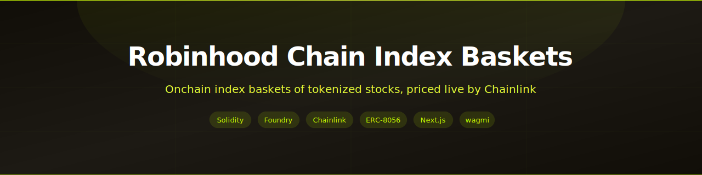

<p align="center">
  
</p>

<p align="center">
  <a href="LICENSE"></a>
  
  
  
  
  <a href="https://github.com/hummusonrails/robinhood-chain-dapp-example/pulls"></a>
</p>

<p align="center">
  <strong>Onchain index baskets of tokenized stocks on Robinhood Chain, minted and redeemed against real Stock Tokens and priced live by Chainlink feeds.</strong>
  <br>
  <a href="#quick-start">Quick Start</a> · <a href="#local-development">Local Development</a> · <a href="#robinhood-chain-cheat-sheet">Chain Cheat Sheet</a> · <a href="https://github.com/hummusonrails/robinhood-chain-dapp-example/issues">Report a Bug</a>
</p>

## What It Does

- **Creates index baskets** of Robinhood Chain Stock Tokens through a permissionless `BasketFactory`, where anyone defines a composition like 0.4 TSLA + 0.3 AMZN + 0.3 NFLX per share
- **Mints basket shares** by depositing the underlying Stock Tokens, so every share is fully collateralized onchain at all times
- **Redeems shares** back into the underlying tokens at any time, with rounding that always favors the basket reserves
- **Prices baskets in USD live** by summing Chainlink price feeds for each component, the same feeds Robinhood Chain publishes for every Stock Token
- **Demonstrates ERC-8056**, the Scaled UI Amount extension Stock Tokens use to handle stock splits without rebasing balances
- **Ships a full frontend** in the Robinhood Chain design language with wallet connection, approvals, minting, redeeming, and live pricing

## Quick Start

```bash
git clone --recurse-submodules https://github.com/hummusonrails/robinhood-chain-dapp-example.git
cd robinhood-chain-dapp-example
pnpm install                # install workspace dependencies
anvil                       # terminal 1: local chain
pnpm run deploy:local       # terminal 2: deploy factory, mocks, and demo basket
pnpm run smoke              # verify mint, price, redeem end to end
pnpm run dev                # start the frontend on localhost:3000
```

## Stack

| Layer | Tool | Notes |
|:------|:-----|:------|
| Contracts | [Solidity 0.8.28](https://soliditylang.org) + [Foundry](https://getfoundry.sh) | The tooling documented by [Robinhood Chain's deploy guide](https://docs.robinhood.com/chain/deploy-smart-contracts/) |
| Token standard | [OpenZeppelin Contracts 5.4.0](https://github.com/OpenZeppelin/openzeppelin-contracts) | ERC-20 base, SafeERC20, ReentrancyGuard, Math |
| Oracles | [Chainlink price feeds](https://docs.chain.link/data-feeds/price-feeds/addresses?network=robinhood) | 8 decimal USD feeds, live on mainnet for every Stock Token |
| Frontend | [Next.js 16](https://nextjs.org) + [wagmi 3](https://wagmi.sh) + [viem 2](https://viem.sh) | App Router, typed ABIs, one hook per contract call |
| Styling | [Tailwind CSS 4](https://tailwindcss.com) | Theme tokens lifted from the Robinhood Chain docs design system |
| Workspace | [pnpm](https://pnpm.io) | Root scripts orchestrate contracts, scripts, and frontend |

<details>
<summary><strong>Prerequisites</strong></summary>

- [Foundry](https://getfoundry.sh) (`forge`, `cast`, `anvil`)
- [Node.js](https://nodejs.org) 20 or newer
- [pnpm](https://pnpm.io) 10 or newer
- A browser wallet like [MetaMask](https://metamask.io) for the frontend

</details>

## Local Development

### 1. Start a local chain

```bash
anvil
```

### 2. Deploy contracts

```bash
pnpm run deploy:local
```

This deploys mock Stock Tokens (with the ERC-8056 surface), mock Chainlink feeds, the `BasketFactory`, and a demo "Tech Trio" basket. It also writes `apps/frontend/.env.local` with the deployed addresses.

### 3. Add the network to MetaMask

| Setting | Value |
|:--------|:------|
| Network name | Local Anvil |
| RPC URL | `http://localhost:8545` |
| Chain ID | `31337` |
| Currency symbol | ETH |

Import the anvil default account to have funds and mock Stock Tokens ready to mint with:

| Field | Value |
|:------|:------|
| Address | `0xf39Fd6e51aad88F6F4ce6aB8827279cffFb92266` |
| Private key | `0xac0974bec39a17e36ba4a6b4d238ff944bacb478cbed5efcae784d7bf4f2ff80` |

> [!NOTE]
> This is the publicly known anvil test key. Never use it, or this import pattern, outside a local devnet.

### 4. Run the frontend

```bash
pnpm run dev
```

## Deploying to Robinhood Chain

### Testnet

Get testnet ETH and testnet Stock Tokens from the [official faucet](https://faucet.testnet.chain.robinhood.com), then:

```bash
PRIVATE_KEY=$YOUR_TESTNET_KEY pnpm run deploy:testnet
```

The testnet deploy composes the demo basket from the **real faucet Stock Tokens** (TSLA, AMZN, NFLX) but deploys **mock Chainlink feeds**, because Chainlink feeds exist on Robinhood Chain mainnet only. Contracts are verified on the testnet Blockscout automatically.

### Mainnet

```bash
PRIVATE_KEY=$YOUR_MAINNET_KEY scripts/deploy.sh mainnet
```

On mainnet the demo basket uses the real TSLA, NVDA, and AAPL Stock Tokens and their real Chainlink feeds. The mainnet fork tests exercise this exact configuration without spending anything:

```bash
pnpm run test:fork
```

## Usage

### Build

```bash
pnpm run build:contracts
```

### Test

```bash
pnpm run test:contracts     # 37 unit tests against mocks
pnpm run test:fork          # 5 fork tests against live mainnet tokens and feeds
```

### Deploy

```bash
pnpm run deploy:local       # anvil with mock tokens and feeds
pnpm run deploy:testnet     # real faucet Stock Tokens, mock feeds, Blockscout verify
```

### Frontend

```bash
pnpm run dev                # dev server
pnpm run build:frontend     # production build
pnpm run lint:frontend      # eslint
```

## Project Structure

```
robinhood-chain-dapp-example/
├── contracts/
│   ├── src/
│   │   ├── BasketFactory.sol          # permissionless basket deployment and registry
│   │   ├── BasketToken.sol            # erc-20 basket with mint, redeem, and usd pricing
│   │   ├── interfaces/
│   │   │   ├── AggregatorV3Interface.sol   # canonical chainlink feed interface
│   │   │   └── IScaledUIAmount.sol         # erc-8056 stock token extension
│   │   └── mocks/
│   │       ├── MockStockToken.sol     # erc-20 + erc-8056 test double
│   │       └── MockPriceFeed.sol      # chainlink compatible settable feed
│   ├── test/
│   │   ├── BasketToken.t.sol          # unit tests with mocks
│   │   ├── BasketFactory.t.sol        # factory tests
│   │   └── fork/
│   │       └── BasketMainnetFork.t.sol     # tests against live mainnet
│   └── script/
│       └── Deploy.s.sol               # network aware deploy script
├── apps/frontend/                     # next.js app in the robinhood chain aesthetic
│   └── src/
│       ├── abi/                       # hand typed abis
│       ├── components/                # ui components
│       ├── config/                    # chains, wagmi, contract addresses
│       └── hooks/                     # one hook per contract interaction
├── scripts/
│   ├── deploy.sh                      # deploy + verify + write frontend env
│   └── smoke.sh                       # end to end cast assertions
└── .github/workflows/ci.yml           # contracts, frontend, and shellcheck jobs
```

## Contract APIs

### BasketFactory

| Function | Access | Description |
|:---------|:-------|:------------|
| `createBasket(name, symbol, components, maxPriceAge)` | Public | Deploys a new `BasketToken` and registers it |
| `allBaskets()` | View | Every basket ever created |
| `basketCount()` / `basketAt(index)` | View | Indexed access to the registry |
| `isBasket(address)` | View | Whether an address was deployed by this factory |

### BasketToken

| Function | Access | Description |
|:---------|:-------|:------------|
| `mint(shares, to)` | Public | Pulls each component via `transferFrom` and mints shares, amounts round up |
| `redeem(shares, to)` | Public | Burns shares and returns each component, amounts round down |
| `quoteMint(shares)` / `quoteRedeem(shares)` | View | Component amounts for a given share count |
| `sharePriceUsd()` | View | USD value of one share with 8 decimals, reverts on stale or invalid feeds |
| `balanceValueUsd(account)` / `totalValueUsd()` | View | Account and total USD value |
| `components()` / `componentCount()` / `componentAt(i)` | View | Basket composition |

## Robinhood Chain Cheat Sheet

Everything below is sourced from the [official docs](https://docs.robinhood.com/chain/) and verified against the live RPCs.

### Networks

| | Mainnet | Testnet |
|:--|:--------|:--------|
| Chain ID | `4663` | `46630` |
| RPC | `https://rpc.mainnet.chain.robinhood.com` | `https://rpc.testnet.chain.robinhood.com` |
| Explorer | [Blockscout](https://robinhoodchain.blockscout.com) | [Blockscout](https://explorer.testnet.chain.robinhood.com) |
| Settles to | Ethereum | Ethereum Sepolia |
| Gas token | ETH | ETH (faucet) |
| Faucet | | [faucet.testnet.chain.robinhood.com](https://faucet.testnet.chain.robinhood.com) |

### Addresses used by this project

| Asset | Network | Address |
|:------|:--------|:--------|
| TSLA Stock Token | Mainnet | `0x322F0929c4625eD5bAd873c95208D54E1c003b2d` |
| NVDA Stock Token | Mainnet | `0xd0601CE157Db5bdC3162BbaC2a2C8aF5320D9EEC` |
| AAPL Stock Token | Mainnet | `0xaF3D76f1834A1d425780943C99Ea8A608f8a93f9` |
| TSLA / USD feed | Mainnet | `0x4A1166a659A55625345e9515b32adECea5547C38` |
| NVDA / USD feed | Mainnet | `0x379EC4f7C378F34a1B47E4F3cbeBCbAC3E8E9F15` |
| AAPL / USD feed | Mainnet | `0x6B22A786bAa607d76728168703a39Ea9C99f2cD0` |
| TSLA Stock Token | Testnet | `0xC9f9c86933092BbbfFF3CCb4b105A4A94bf3Bd4E` |
| AMZN Stock Token | Testnet | `0x5884aD2f920c162CFBbACc88C9C51AA75eC09E02` |
| NFLX Stock Token | Testnet | `0x3b8262A63d25f0477c4DDE23F83cfe22Cb768C93` |

> [!IMPORTANT]
> Always re-verify token addresses against the [official contracts page](https://docs.robinhood.com/chain/contracts/) and feed addresses against the [Chainlink directory](https://docs.chain.link/data-feeds/price-feeds/addresses?network=robinhood) before using them. The docs warn that tokens with matching tickers at other addresses are fakes. Testnet Stock Token addresses are not published in the docs; the ones above were identified from the faucet's onchain activity and verified to expose the ERC-8056 interface.

### Three things that make Stock Tokens teachable

<details>
<summary><strong>ERC-8056: splits without rebasing</strong></summary>

Stock Tokens are plain ERC-20s whose raw balances never change on corporate actions. A stock split updates `uiMultiplier()` instead:

```solidity
underlying shares = raw balance * uiMultiplier() / 1e18
```

`balanceOfUI(account)` returns the scaled number. Chainlink feeds on Robinhood Chain price the raw token with the multiplier already applied, which is why `BasketToken.sharePriceUsd()` never touches the multiplier. The frontend shows it per component so learners can see the mechanism.

</details>

<details>
<summary><strong>Feeds that sleep on weekends</strong></summary>

Equity feeds update 24/5, matching the tokenized stock trading schedule. A naive staleness check of one hour would brick pricing every weekend. `BasketToken` takes `maxPriceAge` as a constructor parameter and the deploy script uses 4 days. Mint and redeem never depend on feed liveness, only the USD views do.

</details>

<details>
<summary><strong>Rounding as a security boundary</strong></summary>

`mint` rounds component amounts up and `redeem` rounds down. Flip either one and dust-sized mints extract value from the reserves. The fuzz test `testFuzz_mintRedeemRoundTrip` demonstrates the invariant.

</details>

## Script Reference

| Script | What it does |
|:-------|:-------------|
| `pnpm run build:contracts` | `forge build` for the contracts workspace |
| `pnpm run test:contracts` | Unit tests with mocks, excludes fork tests |
| `pnpm run test:fork` | Fork tests against Robinhood Chain mainnet |
| `pnpm run fmt:contracts` | `forge fmt` |
| `pnpm run deploy:local` | Deploy everything to anvil and write the frontend env |
| `pnpm run deploy:testnet` | Deploy to testnet with Blockscout verification |
| `pnpm run smoke` | End to end cast assertions against the local deploy |
| `pnpm run dev` | Frontend dev server |
| `pnpm run build:frontend` | Frontend production build |
| `pnpm run lint:frontend` | Frontend eslint |
| `pnpm run check` | Build contracts, run unit tests, build frontend |

## Contributing

Issues and pull requests are welcome. Open an [issue](https://github.com/hummusonrails/robinhood-chain-dapp-example/issues) to discuss larger changes first.

## License

[MIT](LICENSE)
